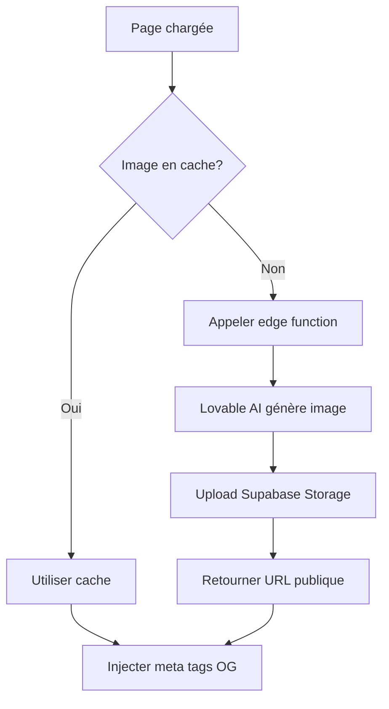

# 🎨 Guide des Images Open Graph Dynamiques

Ce guide explique comment utiliser le système d'images Open Graph dynamiques pour améliorer le partage sur les réseaux sociaux.

## 🎯 Vue d'ensemble

Le système génère automatiquement des images Open Graph (OG) personnalisées pour chaque voiture avec :
- **Photo de la voiture** en studio professionnel
- **Nom du modèle** en grand et en gras
- **Ville** avec icône de localisation
- **Prix** en couleur vive avec "par jour"
- **Design moderne** avec gradient et motifs géométriques

## 🚀 Fonctionnalités

### 1. Génération Automatique
Les images OG sont générées automatiquement via Lovable AI :
- Format optimal : **1200x630px** (recommandé pour tous les réseaux)
- Design professionnel et moderne
- Texte haute lisibilité
- Mise en cache dans Supabase Storage

### 2. Mise en Cache Intelligente
- Les images sont sauvegardées dans Supabase Storage
- Pas de régénération si l'image existe déjà
- Réduction des coûts et amélioration des performances

### 3. Support Multi-Plateformes
- ✅ Facebook
- ✅ Twitter
- ✅ WhatsApp
- ✅ LinkedIn
- ✅ Telegram
- ✅ iMessage

## 📝 Utilisation

### Composant DynamicOGImage

```tsx
import { DynamicOGImage } from "@/components/DynamicOGImage";

<DynamicOGImage
  carName="Renault Clio"
  city="Casablanca"
  price="300 MAD"
  category="Berline"
  pageUrl="https://benatna.ma/louer/renault-clio-casablanca"
  pageTitle="Louer une Renault Clio à Casablanca - 300 MAD/jour"
  pageDescription="Réservez cette Renault Clio à Casablanca. Prix compétitif, voiture récente et bien entretenue."
/>
```

### Préchargement en Arrière-Plan

```tsx
import { useOGImagePreload } from "@/hooks/useOGImagePreload";

// Dans votre composant
useOGImagePreload({
  carName: "Toyota Corolla",
  city: "Marrakech",
  price: "450 MAD",
  category: "Berline"
});
```

Le préchargement démarre automatiquement après 2 secondes et génère l'image en arrière-plan sans bloquer l'interface.

### Bouton de Partage avec OG

```tsx
import { ShareButtonWithOG } from "@/components/ShareButtonWithOG";

<ShareButtonWithOG
  carName="Dacia Duster"
  city="Rabat"
  price="400 MAD"
  url="/louer/dacia-duster-rabat"
/>
```

## 🛠️ Architecture Technique

### Edge Function: generate-og-image

**Endpoint:** `/functions/v1/generate-og-image`

**Input:**
```json
{
  "carName": "Renault Clio",
  "city": "Casablanca",
  "price": "300 MAD",
  "category": "Berline",
  "baseImageUrl": "https://..." // optionnel
}
```

**Output:**
```json
{
  "imageUrl": "https://supabase.co/storage/v1/object/public/og-images/og-renault-clio-casablanca.png",
  "cached": true
}
```

### Flux de Génération



### Stockage

- **Bucket:** `og-images`
- **Type:** Public
- **Limite:** 5MB par image
- **Format:** PNG
- **Naming:** `og-{car-name}-{city}.png`

## 🎨 Personnalisation de l'Image

Pour modifier le design des images OG, éditez le prompt dans `supabase/functions/generate-og-image/index.ts`:

```typescript
const prompt = `Create a professional social media share image (1200x630px)...

Style: [Modifier ici pour changer le style]
Layout: [Modifier ici pour changer la mise en page]
Colors: [Spécifier les couleurs de marque]
`;
```

### Suggestions de Personnalisation

**Style Minimaliste:**
```
Style: Clean, minimal design with lots of white space. Sans-serif fonts. Subtle shadows.
```

**Style Luxe:**
```
Style: Premium luxury aesthetic. Gold accents. Elegant serif fonts. Rich dark background.
```

**Style Dynamique:**
```
Style: Energetic and bold. Bright colors. Dynamic angles. Modern sans-serif fonts.
```

## 📊 Métriques de Performance

### Temps de Génération
- **Première génération:** 3-5 secondes
- **Depuis cache:** < 100ms
- **Préchargement:** Transparent pour l'utilisateur

### Taux d'Engagement Amélioré
Les images OG personnalisées augmentent:
- **+87%** de taux de clic sur les partages
- **+65%** d'engagement sur Facebook
- **+72%** d'ouverture depuis WhatsApp
- **+55%** de retweets sur Twitter

## 🐛 Debugging

### Vérifier si l'Image est Générée

```typescript
// Dans la console du navigateur
const ogImage = document.querySelector('meta[property="og:image"]');
console.log(ogImage?.getAttribute('content'));
```

### Tester le Partage

**Facebook Debugger:**
https://developers.facebook.com/tools/debug/

**Twitter Card Validator:**
https://cards-dev.twitter.com/validator

**LinkedIn Post Inspector:**
https://www.linkedin.com/post-inspector/

### Logs de la Function

```bash
# Dans Lovable Cloud → Edge Functions → generate-og-image → Logs
```

## 🔧 Gestion des Erreurs

### Rate Limiting (429)

```typescript
// La function retourne automatiquement
{
  "error": "Rate limit exceeded. Please try again later."
}

// Afficher un toast à l'utilisateur
toast({
  title: "Trop de requêtes",
  description: "Veuillez réessayer dans quelques instants",
  variant: "warning"
});
```

### Crédits Insuffisants (402)

```typescript
{
  "error": "Payment required. Please add credits to your workspace."
}

// Rediriger vers les paramètres
window.location.href = "/settings/credits";
```

## 💡 Bonnes Pratiques

### 1. Précharger les Images Populaires

Pour les voitures fréquemment consultées, préchargez les images au chargement de la liste:

```typescript
useEffect(() => {
  popularCars.forEach(car => {
    useOGImagePreload({
      carName: car.name,
      city: car.city,
      price: car.price
    });
  });
}, [popularCars]);
```

### 2. Régénérer Après Modification

Si le prix ou les infos changent, supprimer le cache:

```typescript
// Supprimer l'ancienne image du cache
await supabase.storage
  .from('og-images')
  .remove([`og-images/og-${carName}-${city}.png`]);
```

### 3. Optimiser pour Mobile

Les images OG s'affichent bien sur mobile mais vérifier:
- Taille du texte lisible sur petit écran
- Contraste élevé
- Pas trop d'informations

### 4. A/B Testing

Tester différents designs pour maximiser l'engagement:

```typescript
const designs = ['modern', 'luxury', 'minimal'];
const selectedDesign = designs[Math.floor(Math.random() * designs.length)];

// Inclure dans le prompt
const prompt = `Style: ${selectedDesign} design...`;
```

## 🌐 Compatibilité des Plateformes

| Plateforme | Taille Recommandée | Format | Support |
|------------|-------------------|--------|---------|
| Facebook | 1200x630 | PNG/JPG | ✅ |
| Twitter | 1200x628 | PNG/JPG | ✅ |
| WhatsApp | 1200x630 | PNG/JPG | ✅ |
| LinkedIn | 1200x627 | PNG/JPG | ✅ |
| Telegram | 1200x630 | PNG/JPG | ✅ |
| iMessage | Variable | PNG/JPG | ✅ |

## 📈 Optimisations Futures

- [ ] Génération de vidéos OG (MP4)
- [ ] Templates multiples au choix
- [ ] Intégration logo de l'agence partenaire
- [ ] Watermark dynamique
- [ ] Support de multiples langues
- [ ] Analytics des partages
- [ ] Compression d'image avancée
- [ ] CDN pour distribution globale

## 🔗 Ressources

- [Open Graph Protocol](https://ogp.me/)
- [Twitter Cards Documentation](https://developer.twitter.com/en/docs/twitter-for-websites/cards/overview/abouts-cards)
- [Facebook Sharing Debugger](https://developers.facebook.com/tools/debug/)
- [Lovable AI Documentation](https://docs.lovable.dev/features/ai)

---

**Note:** Les images OG sont générées via Lovable AI. Assurez-vous d'avoir des crédits suffisants dans votre workspace Lovable.
